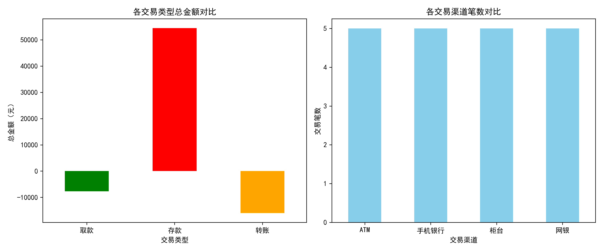

# 银行交易数据分析项目

## 项目概述
这是一个使用Python进行的银行模拟交易数据清洗、分析与可视化项目。作为金融工程背景的初学者，本项目旨在实践将数据分析技术应用于金融场景的完整流程。

## 项目目标
- 模拟生成结构化的银行交易数据
- 实践完整的数据清洗流程（处理缺失值、重复值、异常值）
- 进行多维度业务分析（按交易类型、渠道统计）
- 将分析结果通过图表进行可视化展示

## 技术栈
- **Python 3**
- **Pandas** - 用于数据操作与分析
- **NumPy** - 用于数值计算
- **Matplotlib** - 用于数据可视化

## 项目结构

## 如何运行
1.  确保已安装Python 3及上述库。
2.  克隆本仓库到本地或直接下载`bank_analysis.py`文件。
3.  在终端中运行以下命令：
    ```bash
    python bank_analysis.py
    ```
4.  运行成功后，将在终端查看分析结果，并自动生成可视化图表。

## 核心分析步骤
1.  **数据生成**：使用Python字典结构模拟生成包含交易ID、金额、类型、渠道、状态的交易数据。
2.  **数据清洗**：
    - 检查并处理可能的缺失值与重复记录。
    - 基于业务逻辑（如金额阈值）识别异常交易。
3.  **数据分析**：
    - 计算交易金额的基本统计描述。
    - 按“交易类型”和“交易渠道”进行分组聚合，统计笔数、总额与平均额。
4.  **数据可视化**：
    - 生成“各交易类型总金额对比”柱状图。
    - 生成“各交易渠道笔数对比”柱状图。

## 结果示例


## 后续学习
本项目是学习数据分析的基础实践。后续将基于此数据，尝试使用Java Spring Boot框架构建RESTful API，以提供数据查询服务。
